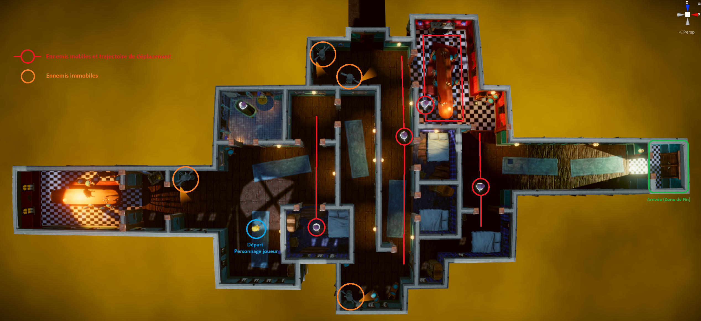

Clément GASPARD
# JohnLemmonGame

## I) Description du Scénario

### A) Explications du Scénario
Le joueur se trouve dans un environnement type Château Hanté, il doit arriver à sortir du manoir sans se faire voir par les différents ennemis du Château (des ennemis statiques : les Gargouilles et des ennemis mobiles : les Fantômes).  
Tout cela doit se passer dans un environnement 3D vivant avec une spacialisation sonore réussie pour une bonne immersion du joueur.  
On fait le choix d'utiliser une vue aérienne accrochée au personnage avec un seul angle de vue (pas de rotation de la caméra).  
On fait aussi le choix de faire déplacer le personnage grâce aux touches d'un clavier , aux joystick d'une manette ou un joystick virtuel. (On aurait pu utiliser un système de clic à l'endroit ou on veut que le personnage aille, mais cela n'est pas du tout pratique avec le type de jeu où l'on veut eviter de se faire voir par des ennemis)
On utilise aussi un menu Pause pour pouvoir quitter le jeu, le recommencer du début ou changer le type de commande (Clavier, Manette, Tactile)

__Commandes du jeu__ : 
- *Mouvements du personnage*  : ZQSD ou les flèches directionelles / Joystick Gauche Manette / Joystick virtuel
- *Menu Pause* : Touche "Echap", Touche "P" / Bouton Start ou Menu Manette / Bouton pause sur l'interface
### B) Carte du Jeu 




## II) Explication concept de Unity

## III) Description du Projet

### A) Etapes de réalisation du Projet

- *1ère Etape* : Animation de marche du Personnage

- *2ème Etape* : Ecriture du Script pour le Mouvement du personnage à partir du nouveau système de gestion de commande de Unity.

- *3ème Etape* : Mise en place de l'Environnement de la scène : 
    * Gestion de l'Illumination de la scène 

    * Création à la main de l'animation de la chaise volante (dans la salle de gauche au démarrage du jeu)

    * Création à la main de l'animation de la sphère volante lumineuse dans la salle à manger (pièce avec la cheminée et la grande table)

- *4ème Etape* : Gestion de la Caméra à partir du plug-in Cinemachine (attache de la camera au personnage principal)

- *5ème Etape* : Ajout des effets de post-processing à la camera : 
    * Anti-aliasing, 

    * Gradient de Couleur,

    * Effet de bloom (flou sur les sources lumineuses), 

    * Occlusion Ambiante, 

    * Vignetage, 

    * Distortion (léger effet fish-eye),

    * Pronfondeur de champ.

- *6ème Etape* : Ecriture du script de fin du jeu :
    * Mise en place d'une zone avec déclencheur de fin du jeu,

    * Mise en place du Canvas de fin du jeu avec l'animation associée (le joueur perd, le joueur gagne).

- *7ème Etape* : Création des ennemis statiques : 
    * Création du Prefab avec la zone de détection du personnage (champ de vision de la Gargouille)
    
    * Animation de la Gargouille,

    * Ecriture de la fonction de détection du Personnage joueur lorsqu'il se trouve dans le champ de vision d'un ennemi grâce au lancer de rayons.

- *8ème Etape* : Génération du NavMesh qui détermine la carte virtuelle où peuvent bouger les ennemis mobiles

- *9ème Etape* : Création des ennemis mobiles :
    * Création du Prefab avec Collider, zone de détection du personnage (champ de vision du fantôme),

    * Animation du Fantôme,

    * Ecriture du script de mouvement des fantômes grâce au NavMeshAgent qui permet de déplacer l'ennemi dans le NavMesh généré à l'étape précédente. (Uilisation de passage par des points de contrôle).

- *10ème Etape* : Audio Spatial :
    * Mise en place de l'audio d'ambiance qui n'est pas 3D et qui est au même niveau de volume où que se trouve le personnage dans la scène

    * De la même manière, mise en place des musiques de fin du jeu (le joueur perd, le joueur gagne)

    * Ajout du son des pieds du joueur quand il se déplace et synchronisation avec l'animation de marche du personnage

    * Ajout des différentes sources Audios 3D aux éléments du jeu (Chandelles sur les murs, fantômes) et ajustement des paramètres d'Audio 3D pour faire en sorte que le son diminue avec la distance et puisse être localisable avec un son binaural (casque audio) ou un système audio multicanal (home cinéma multi-enceintes).

    * Création de l'AudioListener et écriture d'un script permettant sa fixation au niveau de la tête, entre les oreilles du personnage sans qu'il ne soit affecté par la rotation de celui-ci.

- *11ème Etape* : Création d'un Canvas de Menu Pause (Le joueur peut mettre en pause, recommencer au début, ou quitter le jeu)

- *12ème étape* : Adaptation du projet pour multi-platerforme : 
    * Ajout d'un joystick virtuel pour pouvoir jouer au jeu depuis un appareil mobile ou un ordinateur tactile.

    * Ajout au Menu pause d'une possibilité de choisir son système de contrôle du joueur (Soit clavier, soit Manette de jeu, soit interface tactile)

    * Adaptation du niveau de qualité du jeu en fonction des types d'appareil (Haute qualité pour un PC Windows, qualité moyenne avec quelques sacrifices pour le téléphone Android)

- *13 Etape* : Exportation du projet : 
    * Création d'un executable pour Windows (x64)

    * Création d'un apk pour téléphone ou tablette Android (Attention le framerate de l'application dépend énormément de la puissance graphique de l'appareil Android utilisé)


### B) Arborescence du Projet

```bash
├───Animation  
│   ├───Animation # Animations pures d'un Objet 3D
│   └───Animators # Machines à états d'utilisation des Animations associées à un GameObject
├───Audio  #Fichiers Audios utilisés dans le Projet
├───Build # Fichiers executables pour les différentes plateforme
│   ├───Windows # Application .exe pour Windows (x64)
│   └───Android # Application .apk à installer sur un téléphone portable ou une tablette Android
├───Gizmos  
│   └───Cinemachine
├───Materials # Matériaux des différents Objets 3D du Projet (associés aux textures)
│   ├───Bathroom  
│   ├───BedRoom  
│   ├───Characters  
│   ├───Corridor  
│   ├───DiningRoom  
│   └───VFX  
├───Models # Modèles 3D utilisés dans le Projet (sans textures)
│   ├───Bathroom  
│   ├───Bedroom  
│   ├───Characters  
│   ├───Corridor  
│   ├───Diningroom  
│   └───VFX  
├───Prefabs # Préfariqués du Projet (Personnages, Objets de l'Environnement, Animations)
│   ├───Environment  # Préfabriqués associés à l'Environnement du Projet
│   │   ├───Bathroom  
│   │   ├───Bedroom  
│   │   ├───Corridors  
│   │   └───Dinigroom  
│   └───VFX  # Préfabriqués d'Objets animés
├───Scenes  
│   ├───SampleScene # Mesh de Navigation pour les ennemis
│   └───SampleScene_Profiles # Profil des Effets de PostProduction appliqués à la Caméra du Joueur
├───Scripts  #Scripts du Projet
├───Shaders  
└───Textures  # Textures des différents Matériaux du Projet / Images
    ├───BathRoom  
    ├───BedRoom  
    ├───Characters  
    ├───Corridor  
    ├───DiningRoom  
    ├───Icon  # Icone de l'Application Android / Logiciel Windows
    ├───UI  # Images associées aux Menu pause et à l'interface générale
    └───VFX  
```